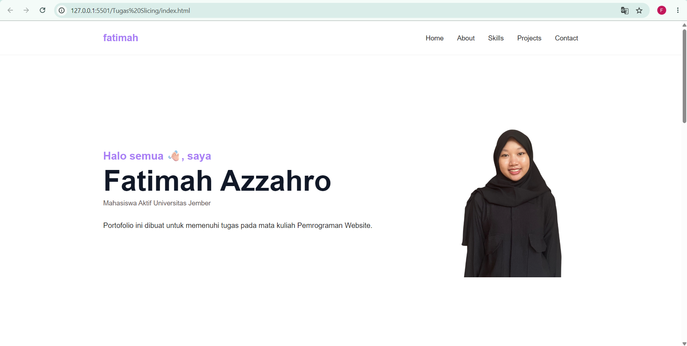
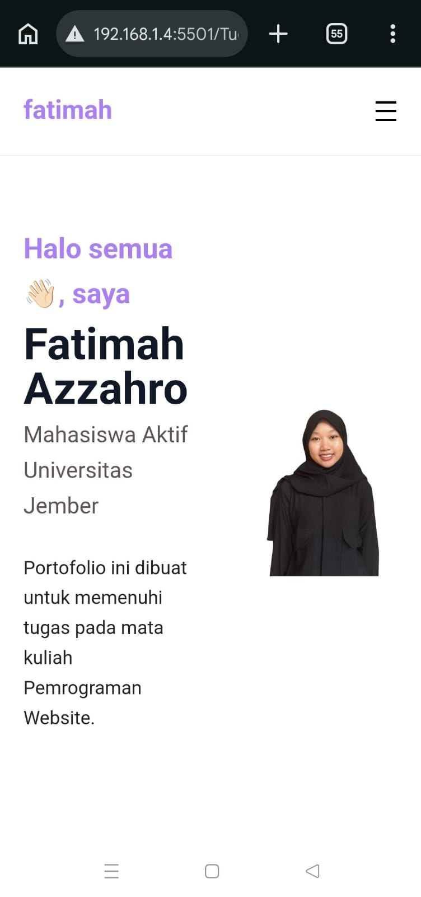
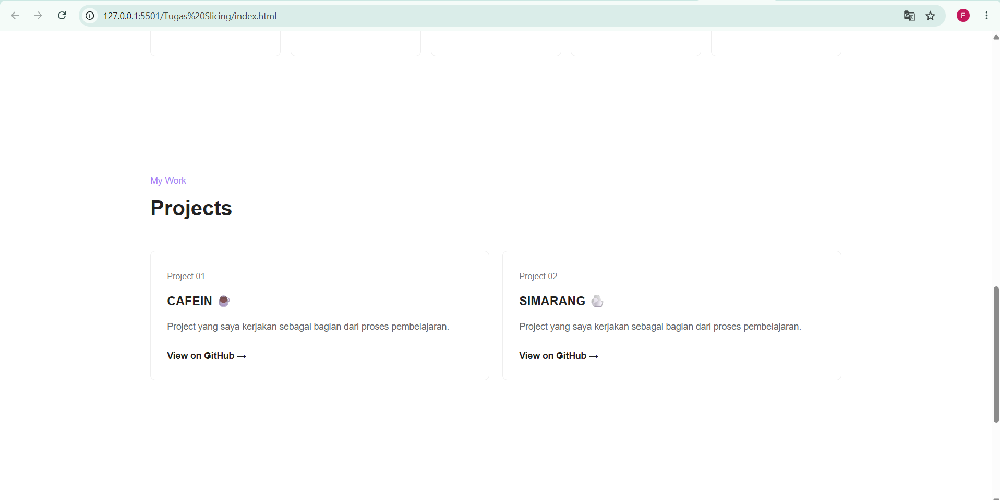
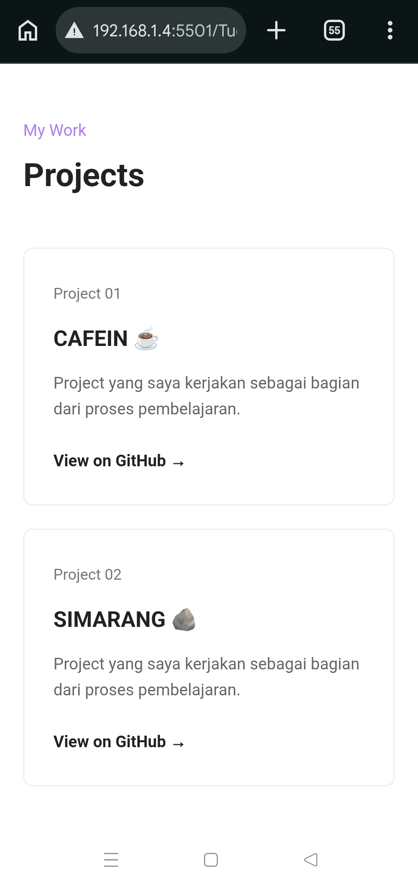

# Portfolio Fatimah Azzahro

Website portfolio pribadi yang dibuat untuk memenuhi tugas mata kuliah Pemrograman Web dengan topik Slicing Website HTML, CSS, dan JavaScript.

## Screenshot

### Home - Desktop



### Home - Mobile



### Projects - Desktop



### Projects - Mobile



## Tentang Project

Website ini berisi halaman portfolio sederhana yang menampilkan profil, data diri, skill, project yang pernah dikerjakan,serta cotact person. Website dibuat menggunakan HTML, CSS murni tanpa framework seperti Tailwind atau Bootstrap, dan JavaScript untuk interaksi menu.

Beberapa hal yang diterapkan:

- Layout responsive untuk tampilan mobile, tablet, dan desktop
- Navbar dengan menu hamburger yang bisa dibuka-tutup pada layar kecil
- Section Home, About, Skills, Projects, dan Contact
- Link ke repository project lain (CAFEIN dan SIMARANG) langsung dari kartu project

## Tech Stack

- HTML5
- CSS3 (Flexbox dan Grid)
- JavaScript (DOM)

## Struktur File

```text
├── index.html
├── style.css
├── script.js
├── foto diri.png
├── desktop_about_skill.png
├── desktop_contact.png
├── desktop_home.png
├── desktop_project.png
├── mobile_about.jpeg
├── mobile_contact.jpeg
├── mobile_home.jpeg
├── mobile_project.jpeg
├── mobile_skill.jpeg
└── README.md

